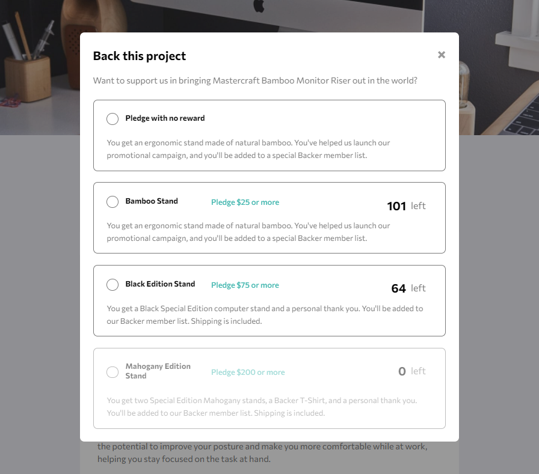
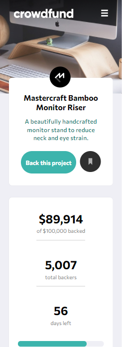

# crowfunding-product-page
A mockup of a Crowfunding Product.

# Technologies
In this project I used HTML, SCSS(SASS), JS.

[This is a challenge of FrontEnd Mentor](https://www.frontendmentor.io/challenges/crowdfunding-product-page-7uvcZe7ZR).

## Result

> ### See the result live [here](https://crowfunding-product-page.vercel.app/)

Desktop Version -

Mobile Version -

